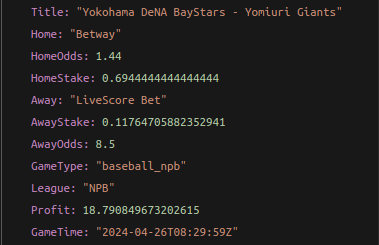

# ArbitrageClient


[](https://coveralls.io/github.com/robinmuhia/arbitrageClient?branch=main)

### Domain

Get free money!!!

Arbitrage betting is a strategy where a bettor takes advantage of differences in odds offered by different bookmakers to guarantee a profit. By placing bets on all possible outcomes of a sports event across different bookmakers, the bettor ensures that they will make a profit regardless of the outcome. This is possible when the odds offered by different bookmakers imply probabilities that add up to less than 100%. The bettor calculates the optimal bet sizes to ensure a profit regardless of the outcome. Arbitrage opportunities are usually short-lived and require quick action to exploit.

To learn more about arbitrage betting, read [this](https://www.sbo.net/strategy/arbitrage-betting/)

### Usage

We currently only implement version 4 of the Odds API

Get an odds api key from [Sport Odds API](https://the-odds-api.com/)\

You will need the following env variables and name them as is;

```bash
ODDS_API_BASE_URL="https://api.the-odds-api.com/v4"
ODDS_API_KEY=<SPORTS KEY HERE>

```

## Installation

To install the SDK, you need to have Go 1.21

```bash
  go get github.com/robinmuhia/arbitrageClient

  import ("github.com/robinmuhia/arbitrageClient")
```

## Implementation

```go
package main

import (
  "context"

	"github.com/robinmuhia/arbitrageClient/arbs"
)

func main() {
	// Create a context
  ctx := context.Background()

  // We need to pass the params to get odds from specific formats
  // We currently only support decimal format for oddsFormat
  arbParams := arbs.ArbsParams{
              Region : "uk",
              Markets: "h2h",
              OddsFormat: "decimal",
              DateFormat: "iso",
             }
  threeArbs, twoArbs, err := arbs.GetAllArbs(ctx, arbParams)

  if err != nil {
    // handle err
  }

  fmt.Println(threeArbs, twoArbs)
}
```

### Output

```go
// ThreeOddsArb represents the structure of how a match with three possible outcomes
// i.e a win, draw or loss will be represented in the response
type ThreeOddsArb struct {
	Title    string
	Home     string // home bookmarker
	Draw     string // draw bookmarker
	Away     string // away bookmarker
	HomeOdds float64 // home bookmarker odds
	DrawOdds float64 // draw bookmarker ddds
	AwayOdds float64 // away book marker odds
	GameType string
	League   string
	Profit   float64
	GameTime string
}

// TwoOddsArb represents the structure of how a match with three possible outcomes
// i.e a win or loss will be represented in the response
type TwoOddsArb struct {
	Title    string
	Home     string // home bookmarker
	Away     string // away bookmarker
	HomeOdds float64 // home bookmarker odds
	AwayOdds float64 // away book marker odds
	GameType string
	League   string
	Profit   float64
	GameTime string
}

```


<br/>


## Description

The project implements the `Clean Architecture` advocated by
Robert Martin ('Uncle Bob').

### Points to note

- Interfaces let Go programmers describe what their package provides–not how it does it. This is all just another way of saying “decoupling”, which is indeed the goal, because software that is loosely coupled is software that is easier to change.
- Design your public API/ports to keep secrets(Hide implementation details)
  abstract information that you present so that you can change your implementation behind your public API without changing the contract of exchanging information with other services.

For more information, see:

- [The Clean Architecture](https://blog.8thlight.com/uncle-bob/2012/08/13/the-clean-architecture.html) advocated by Robert Martin ('Uncle Bob')
- Ports & Adapters or [Hexagonal Architecture](http://alistair.cockburn.us/Hexagonal+architecture) by Alistair Cockburn
- [Onion Architecture](http://jeffreypalermo.com/blog/the-onion-architecture-part-1/) by Jeffrey Palermo
- [Implementing Domain-Driven Design](http://www.amazon.com/Implementing-Domain-Driven-Design-Vaughn-Vernon/dp/0321834577)
